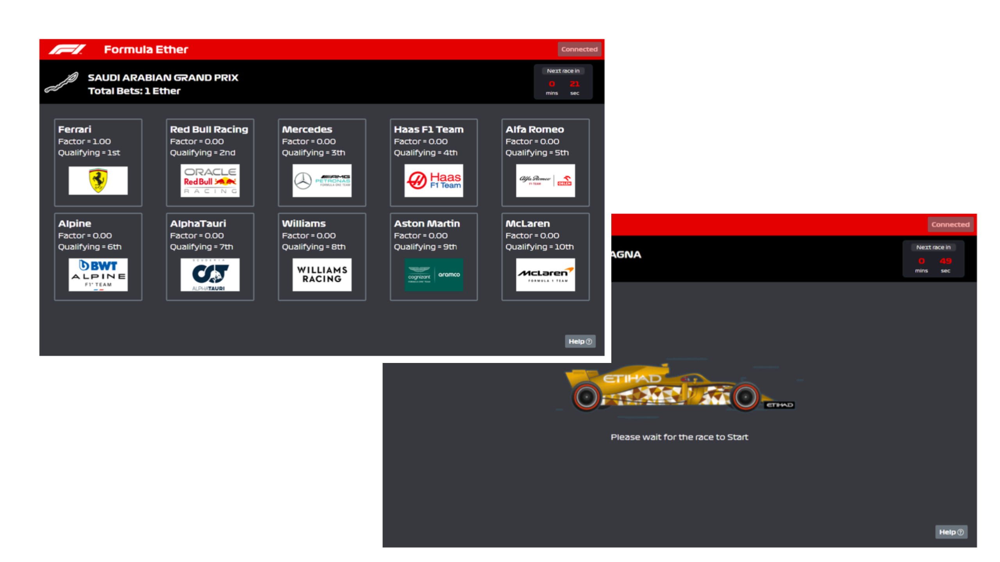

# Formula Ether

Formula Ether is a dApp running on Ethereum, where multiple users can bet on their favorite Formula 1 teams.
The game logic is implemented within a smart contract deployed on the blockchain.



## Installation Requirements

- Node.js version > 12.0.0: https://nodejs.org/en/download/
- Metamask browser extension: https://metamask.io/
- Ganache or a connection to the UZHETH Blockchain
- Deployed smart contract and its address

### Blockchain Connection
This client needs a connection to a local Ganche instance. The [contract](https://github.com/janousy/formula-ether/blob/999193c500040612153204c28767041a0845942d/src/contracts/bettingContract.sol)
can be deployed with e.g. [Remix IDE](remix.ethereum.org) by adding the local Ganache network to Metamask and the selecting `Injected Web3`
as the environment upon deploying the contract. In this case the contract address needs to be updated in ```src/consts/addresses.const.js```
The client will connect to this chain and
interact with the deployed betting contract to place bets and retrieve winners.

Alternatively, you can use the UZHETH blockchain, providing an account with some assets available. 
Therefore, the user needs to be within the UZH network, or establish a VPN connection.
To connect to the UZHETH blockchain the following credentials can be used:
- Networkname: UZHETH
- New RPC-URL: http://130.60.244.246:8545
- Chain ID: 702
- Currency Symbol: UZHETH

More information about the UZHEthereum chain can be found [here](http://130.60.24.79:1234/?network=UZHETH).

## Project setup
```
npm install
```

### Compiles and hot-reloads for development
```
npm run serve
```

### Compiles and minifies for production
```
npm run build
```

### Lints and fixes files
```
npm run lint
```

### Customize configuration
See [Configuration Reference](https://cli.vuejs.org/config/).
